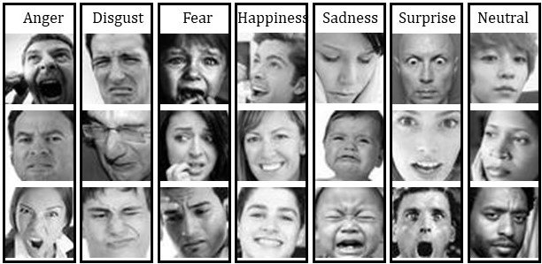

<p align="center">
  <h3 align="center">Emotion Detection With CNN</h3>
  <p align="center">
    This project focuses on training an emotion detector using Convolutional Neural Networks (CNN). It involves the use of popular deep learning libraries such as Keras and TensorFlow. The detector is trained on the FER2013 dataset, which contains facial expression images representing different emotions.
    <br/>
  </p>
</p>

    



## Installation
Before getting started, make sure to install the necessary packages by running the following commands in your terminal:

```
pip install numpy
pip install opencv-python
pipRunning the Emotion Detection Test
To run the emotion detection test file, execute the following command:
install keras
pip install --upgrade tensorflow
pip install pillow
```
## Dataset
Download FER2013 dataset from below link and put in data folder under your project directory.
-   https://www.kaggle.com/msambare/fer2013

## Training the Emotion Detector
To train the emotion detector using all the facial expression images in the FER2013 dataset, run the following command:

```
python TrainEmotionDetector.py
```
This command will start the training process and build a CNN model using the provided dataset.

## Running the Emotion Detection Test
To run the emotion detection test file, execute the following command:
```
streamlit run streamlit_app.py
```
This command will start a Streamlit web application where you can interact with the trained emotion detector. The application will allow you to upload an image and detect the emotion portrayed in the image.
